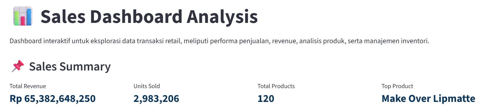
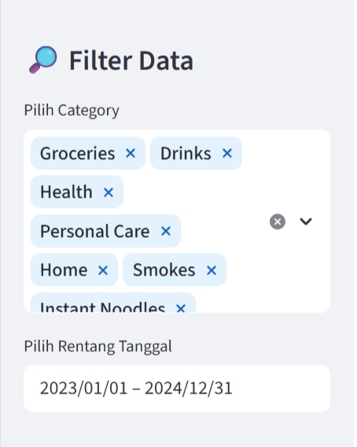
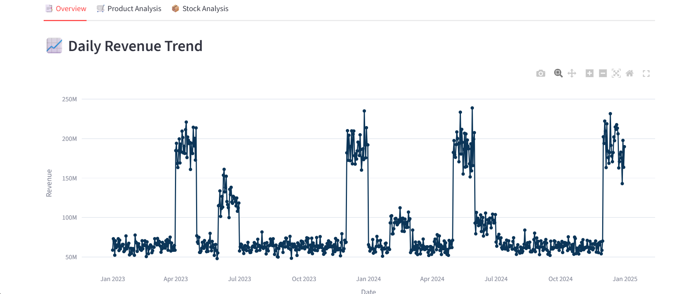
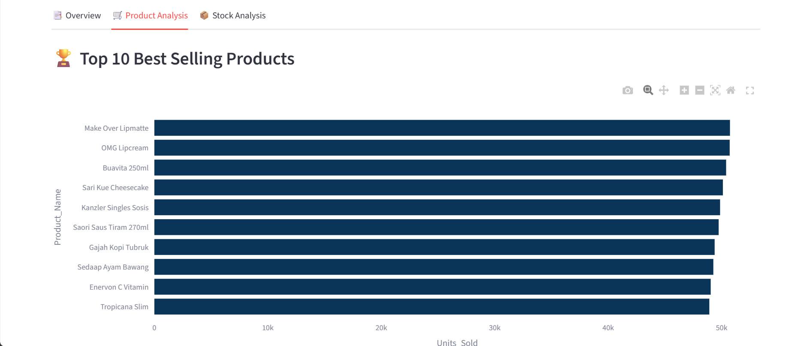
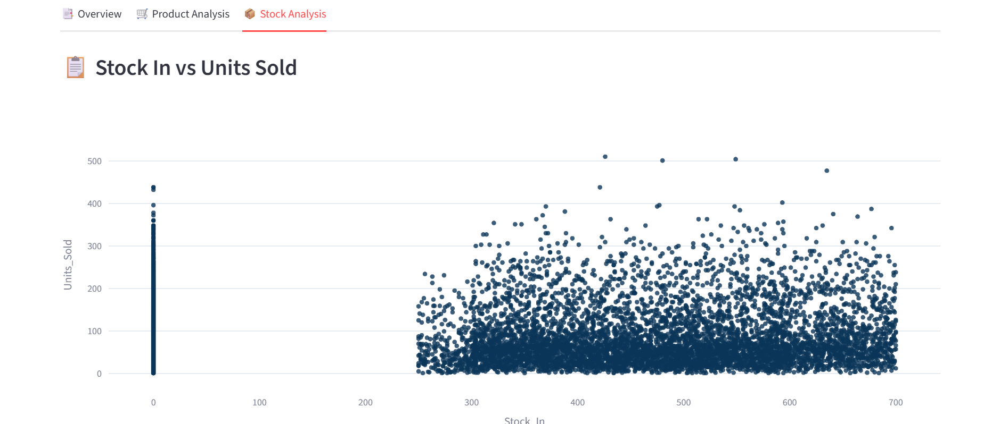
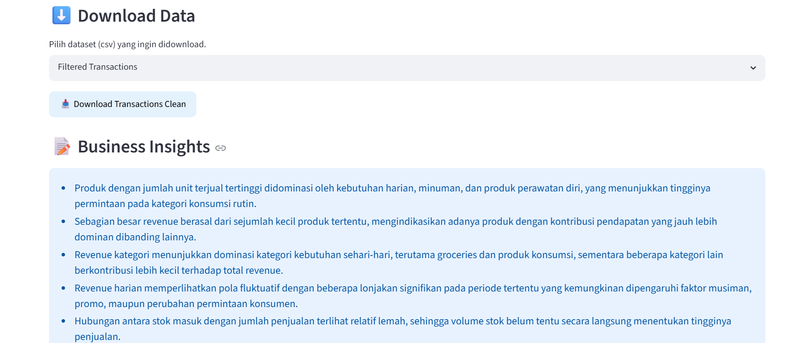

# 📊 Sales Dashboard — Retail Transaction Analysis

Dashboard interaktif berbasis Streamlit untuk visualisasi dan eksplorasi data transaksi retail.

Dashboard membantu analisis performa penjualan, monitoring inventori, serta identifikasi pola transaksi melalui visualisasi interaktif.

---

## Dashboard Features

### 📌 Sales Summary

Ringkasan metrik utama bisnis:

- Total Revenue
- Total Units Sold
- Total Products
- Top Product

### 🔎 Sidebar Filters

Dashboard menyediakan filter interaktif untuk eksplorasi data:

- Rentang tanggal
- Kategori produk

### 📑 Overview

Visualisasi performa bisnis secara umum:

- Daily Revenue Trend
- Revenue by Category

### 🛒 Product Analysis

Analisis performa produk:

- Top 10 Best Selling Products
- Top 10 Revenue Products
- Pareto Analysis

### 📦 Stock Analysis

Analisis inventori:

- Stock In vs Units Sold
- Stock End vs Units Sold
- Fast Moving Products
- Slow Moving Products

### ⬇️ Download Data

Download dataset berdasarkan filter:
- Filtered Transactions
- Transactions Clean
- Transaction Raw
- Stock Raw

### 📝 Business Insights

Ringkasan insight bisnis berdasarkan hasil analisis data.

---

## Dashboard Preview

### 📌 Sales Summary



### 🔎 Sidebar Filters



### 📑 Overview



### 🛒 Product Analysis



### 📦 Stock Analysis



### ⬇️ Download and Insights



---

## Run Dashboard Locally

### 1. Masuk ke folder dashboard

```bash
cd data-science/dashboard
```

### 2. Install dependency

```bash
pip install -r requirements.txt
```

### 3. Jalankan dashboard

```bash
streamlit run dashboard.py
```

---

## 📌 Notes

- Dashboard menggunakan dataset transaksi hasil preprocessing (`transactions_clean.csv`).
- Informasi detail mengenai preprocessing, dataset, dan definisi variabel dapat dilihat pada `data-science/data_dictionary.md`.